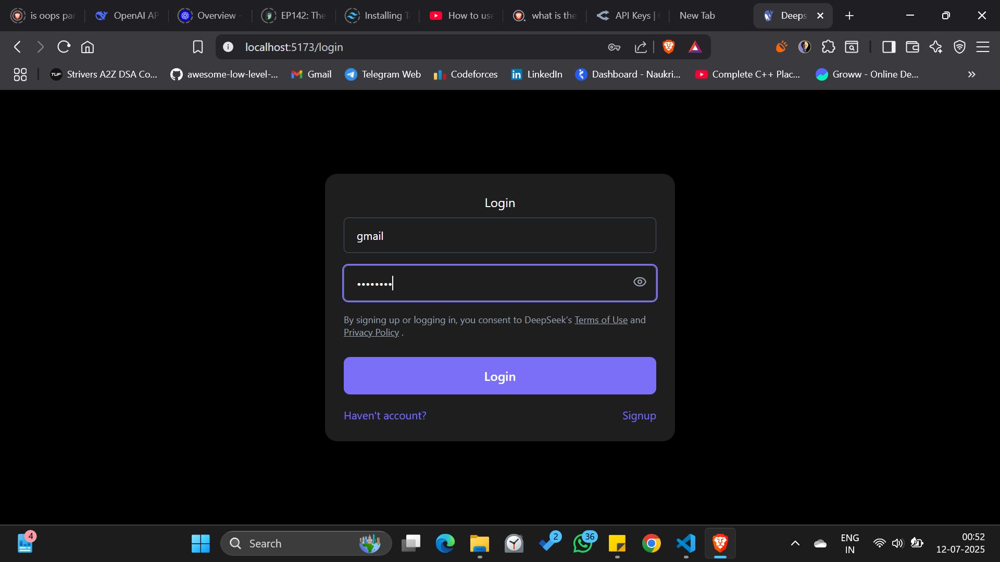
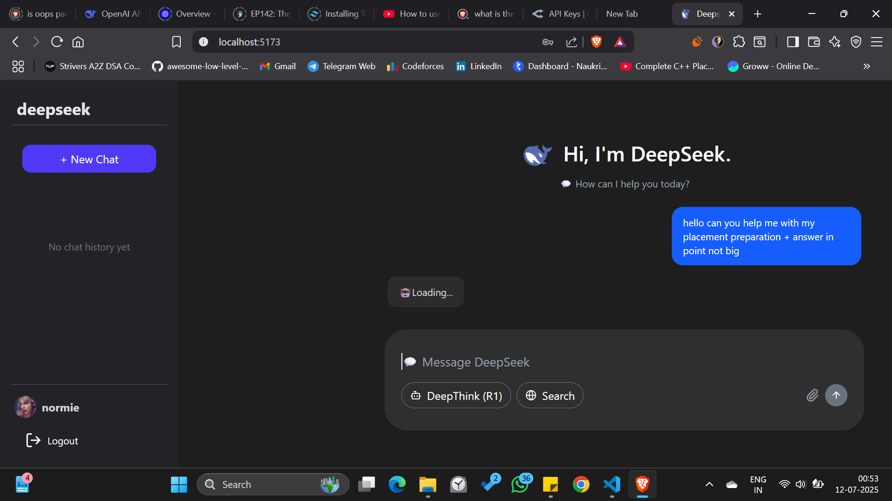
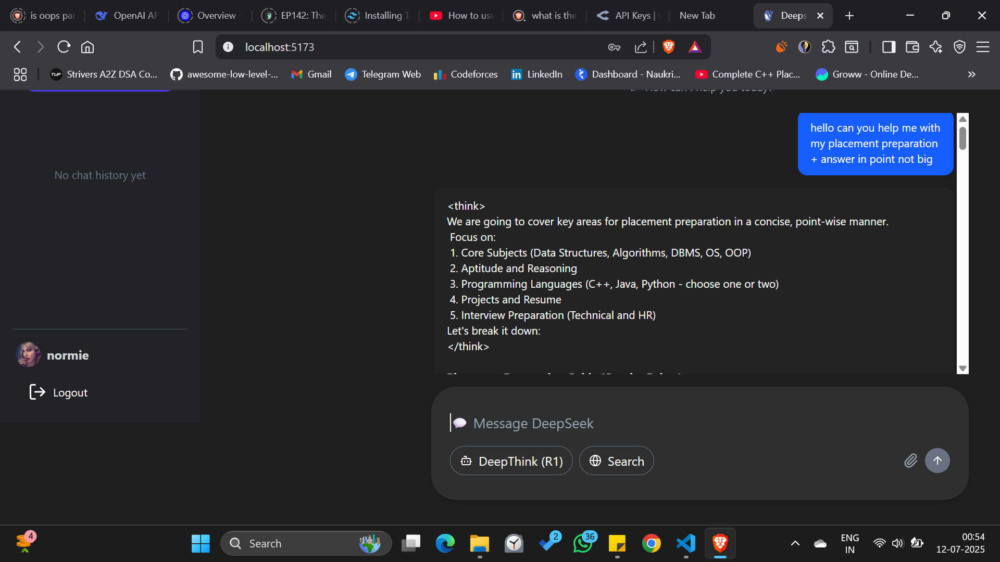

# 🧠 DeepSeek Chat API Integration

A full-stack application with a Node.js backend API that integrates with DeepSeek's AI models using GitHub's Azure Inference API, enabling seamless AI chat capabilities with JWT-based user authentication and conversation history.

The React + Tailwind CSS frontend offers a clean, responsive UI for interacting with the AI model, managing sessions, and displaying chat logs with real-time feedback.

---

## 🚀 Features

- 💬 **Chat with DeepSeek AI models** powered by Azure's inference API (`@azure-rest/ai-inference`, `openai`)
- 🔐 **Secure JWT-based user authentication** using `jsonwebtoken` and `bcryptjs`
- 🧠 **Real-time AI responses** with fast, low-latency inference via Azure
- 📝 **Persistent chat history**, stored using MongoDB and `mongoose`
- 🌐 **CORS-enabled Express backend API** with `cookie-parser` for session handling
- ⚛️ **Modern React 19 frontend** with `react-router-dom` for navigation
- 🎨 **Fully responsive UI** styled with `Tailwind CSS` and `lucide-react` icons
- ✨ **Markdown rendering** support via `react-markdown` + `remark-gfm`
- 🧠 **Syntax highlighting** for code blocks using `react-syntax-highlighter`
- 🍪 **Session storage** and token handling using `js-cookie`


---

## 🛠️ Tech Stack


---

## 📦 Installation

```bash
# 1. Clone the repository
git clone https://github.dev/lakshay0nsut/DeepseekClone.git

# 2. Navigate into the project
cd DeepseekClone

# 3. Install dependencies
npm install
```
## 📸 Screenshots

### 🔹 LOG IN


### 🔹 PROMPT


### 🔹 RESPONSE



🙌 Credits

DeepSeek – AI models

Azure AI Inference – Hosting infrastructure

marketplace – [API gateway](https://github.com/marketplace/models/)


